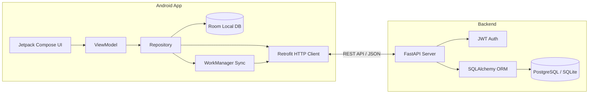

# JamiaFix

JamiaFix is a full-stack campus maintenance and issue tracking system. It consists of an Android application built with **Jetpack Compose & Kotlin** and a REST API backend powered by **FastAPI & PostgreSQL/SQLite**.

The system enables students and university staff to log maintenance complaints (electrical, plumbing, Wi-Fi, carpentry, etc.), track resolution progress in real-time, and work seamlessly offline. Reports created without internet connection are cached locally via **Room** and synced automatically in the background using **WorkManager**.

---

## 📷 App Screenshots

*(Place your screenshots inside `docs/screenshots/` with the filenames listed below)*

| Login & Register | Student Dashboard | Report Issue |
| :---: | :---: | :---: |
|  <br> `01_login_screen.png` |  <br> `02_student_home.png` |  <br> `03_create_issue.png` |

| Issue Timeline | Staff Resolution Portal | Admin Panel |
| :---: | :---: | :---: |
|  <br> `04_issue_detail.png` |  <br> `05_staff_home.png` |  <br> `06_admin_dashboard.png` |

| FastAPI Swagger Docs |
| :---: |
|  <br> `07_api_swagger.png` (`http://localhost:8000/docs`) |

---

## 🔥 Core Features

- **Role-Based Access Control**:
  - **Student / Resident**: Log issues with location, category, and photo attachments; track resolution status on a visual timeline.
  - **Maintenance Staff**: View assigned work orders, update status (`Pending` ➔ `In Progress` ➔ `Resolved`), and add remarks.
  - **Admin**: Dashboard for managing departments, categories, locations, and user accounts.
- **Offline-First Sync**: Reports created offline are stored in local SQLite via Room DB and pushed to the backend via `WorkManager` background sync once online.
- **JWT Authentication**: Secure token-based auth with Argon2 password hashing.
- **RESTful API**: Fast endpoints with auto-generated Swagger documentation at `/docs`.

---

## 🛠️ Tech Stack

### Android App
- **Language**: Kotlin
- **UI Framework**: Jetpack Compose + Material 3
- **Architecture**: MVVM with StateFlow & Coroutines
- **Networking**: Retrofit 2 + OkHttp 4
- **Local Storage**: Room Database + DataStore Preferences
- **Background Tasks**: AndroidX WorkManager
- **Image Loading**: Coil Compose

### Backend API
- **Framework**: FastAPI (Python 3.10+)
- **ORM**: SQLAlchemy 2.0
- **Database**: PostgreSQL / SQLite
- **Auth**: PyJWT & Argon2 (`pwdlib` / `argon2-cffi`)
- **Validation**: Pydantic v2
- **Server**: Uvicorn

---

## 📐 Architecture Overview



---

## 📂 Project Structure

```
JamiaFix/
├── app/                                  # Android App (Kotlin + Compose)
│   ├── build.gradle.kts
│   └── src/main/java/com/jamiafix/app/
│       ├── JamiaFixApp.kt
│       ├── MainActivity.kt
│       ├── data/                         # Local DB, Remote API, WorkManager
│       │   ├── local/                    # Room DB & DataStore
│       │   ├── model/                    # Data models
│       │   ├── remote/                   # Retrofit API interface
│       │   ├── repository/               # Repository pattern implementations
│       │   └── worker/                   # WorkManager sync task
│       └── ui/                           # Compose UI Screens & Navigation
│           ├── components/               # Reusable UI components
│           ├── navigation/               # NavGraph & routes
│           └── screens/                  # Admin, Auth, Issue & Staff screens
│
├── backend/                              # FastAPI Backend
│   ├── requirements.txt
│   ├── app/
│   │   ├── main.py                       # FastAPI entry point
│   │   ├── database.py                   # DB connection setup
│   │   ├── auth.py                       # JWT & password hashing
│   │   ├── seed.py                       # Seed script for initial categories/locations
│   │   ├── models/                       # SQLAlchemy models
│   │   ├── schemas/                      # Pydantic validation schemas
│   │   └── routers/                      # API endpoint handlers
│   └── tests/                            # Pytest test suite
│
└── README.md
```

---

## ⚡ Quick Start & Installation

### Prerequisites
- **Android Studio** (Ladybug 2024.2+ or newer) with JDK 17
- **Python 3.10+**
- **Git**

### 1. Backend Setup

```bash
# Navigate to backend directory
cd backend

# Create virtual environment
python -m venv venv

# Activate virtual environment
# On Windows:
.\venv\Scripts\activate
# On Linux/macOS:
source venv/bin/activate

# Install dependencies
pip install -r requirements.txt

# Seed initial database (categories & campus locations)
python -m app.seed

# Start dev server
uvicorn app.main:app --reload --host 0.0.0.0 --port 8000
```

Once running, visit `http://localhost:8000/docs` to test the API via Swagger UI.

### 2. Android App Setup

1. Open the project folder in **Android Studio**.
2. If testing on an Android Emulator, the app connects to `http://10.0.2.2:8000/` by default in `ApiClient.kt`.
   If testing on a physical device, update `BASE_URL` in `ApiClient.kt` to your local machine's IP address (e.g. `http://192.168.1.5:8000/`).
3. Sync Gradle and run the app on your emulator or connected device.

---

## 🔗 Main API Endpoints

| Method | Endpoint | Description | Auth |
| :--- | :--- | :--- | :---: |
| `POST` | `/auth/register` | Register new user | Public |
| `POST` | `/auth/login` | Login & receive JWT token | Public |
| `GET` | `/auth/me` | Current user profile | Bearer Token |
| `GET` | `/issues/` | List issues (filterable by status) | Bearer Token |
| `POST` | `/issues/` | Submit a new issue report | Bearer Token |
| `GET` | `/issues/{id}` | Get issue details & activity timeline | Bearer Token |
| `PUT` | `/issues/{id}/status` | Update status (`IN_PROGRESS`, `RESOLVED`) | Bearer Token |
| `GET` | `/meta/categories` | Get issue categories | Bearer Token |
| `GET` | `/meta/locations` | Get campus locations/hostels | Bearer Token |

---

